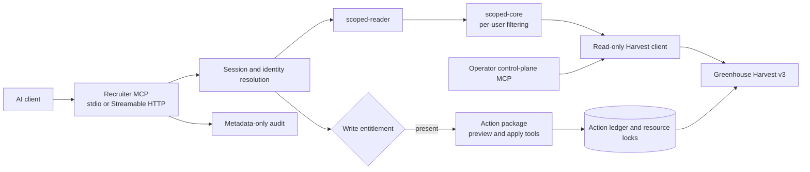

# Greenhouse MCP

Greenhouse MCP provides permission-scoped Model Context Protocol servers over
Greenhouse Harvest v3. It includes a recruiter-facing read surface, a separate
operator control plane, and an approval-gated action package mounted into the
recruiter runtime for explicitly entitled sessions.

This repository is a curated snapshot of the internal system as of 21 August
2026. Private development history, credentials, issued sessions, and live rollout
evidence are not included.

## Runtime topology



The hosted recruiter server starts from
`packages/recruiter-mcp/bin/greenhouse-recruiter-mcp-http.mjs`. A stdio
entrypoint serves local MCP clients. Both use the same scoped read path.

The action package is not a second MCP service in the current runtime. When the
action plane is configured and a session has an active entitlement, its tools are
appended to that session's recruiter catalog. A session without the entitlement
receives the unchanged read catalog.

## Recruiter read path

Recruiter sessions identify a person; they do not carry Greenhouse roles, job ids,
or permission claims. On every scoped read, the runtime resolves the session
identity and derives current access from Greenhouse. Permission changes therefore
take effect without reissuing authority in the MCP token.

All recruiter tools route raw reads through `src/scoped-reader.ts`. Static guards
enforce two boundaries:

1. Raw Greenhouse read primitives may be called only from the scoped reader.
2. The write-bearing client module may not be imported by recruiter runtime code.

The scoped core filters returned rows by actor and denies unknown permission
shapes. Tool-specific projections then remove fields that do not belong on the
model-facing surface. Resume content has one explicit path:
`read_my_resume` accepts an attachment id, rechecks access, downloads under
size and time limits, extracts text, and never returns the signed URL or raw bytes.

The curated recruiter catalog combines scoped evidence reads with deterministic
analysis tools for job scope, feedback drag, stage latency, pipeline state, source
outcomes, and rejection-reason drift. Analysis tools compute their metrics in code
and return evidence ids for follow-up; the model does not calculate the result.

## Action path

The action package defines eleven fixed capabilities as twenty-two paired tools:
one preview and one apply tool per capability. There is no bulk endpoint and no
model-selectable HTTP method or route.

A preview resolves the actor, current state, visibility, permissions, destination,
and effects, then signs a short-lived intent over the exact change. Apply accepts
that intent and approval echo, repeats the material reads, claims the resource
lock, sends at most one mutation, and verifies the result by readback.

Network failures, timeouts, ambiguous acknowledgements, and inconclusive readback
are recorded as unknown rather than retried. The reconciliation command reads
Greenhouse to resolve those records without sending business-data mutations.
Action state contains bindings, fingerprints, and operational metadata rather than
candidate text, note bodies, contact values, compensation values, or bearer tokens.

The service and write switches default off. Per-user entitlements independently
control preview, apply, and high-impact apply access.

## Packages

| Path | Responsibility |
|---|---|
| `packages/control-plane/` | Unscoped, read-only operator MCP for ATS administration |
| `packages/scoped-core/` | Actor resolution and permission filtering with default-deny behavior |
| `packages/recruiter-mcp/` | Recruiter sessions, scoped tools, HTTP/stdio transports, audit, and action mounting |
| `packages/action-mcp/` | Typed preview/apply definitions, signing, ledger, locking, and reconciliation |
| `packages/slack-mcp/` | Allowlisted Slack direct-message delivery with cached user resolution |

The unscoped control plane is an operator surface and should be distributed only
to people who already hold tenant-wide ATS authority. Recruiter clients should use
the scoped server.

## Entrypoints

| Surface | Entrypoint |
|---|---|
| Recruiter MCP over HTTP | `packages/recruiter-mcp/bin/greenhouse-recruiter-mcp-http.mjs` |
| Recruiter MCP over stdio | `packages/recruiter-mcp/bin/greenhouse-recruiter-mcp.mjs` |
| Operator MCP over stdio | `packages/control-plane/dist/index.js` after build |
| Action reconciliation | `packages/action-mcp/bin/greenhouse-action-reconcile.mjs` |
| Slack MCP over stdio | `packages/slack-mcp/dist/index.js` after build |

The production container combines the compiled control-plane and action packages
with the recruiter runtime:

```bash
docker build -f packages/recruiter-mcp/deploy/Dockerfile .
```

## Verification

Node.js 22 is the CI runtime. Install the locked workspace dependencies and run
the credential-free gate from the repository root:

```bash
npm ci
npm run verify
node packages/recruiter-mcp/scripts/verify-package.mjs
```

The gate builds the compiled packages, type-checks every workspace, runs the test
suites, and executes package guards. Harvest contract-conformance tests skip when
the optional local vendor-documentation mirror is absent; the generated registry
remains source-controlled.

Credentialed probes, container smoke tests, session issuance, and distribution
evidence are separate operator workflows. They do not run as part of the default
verification command.

## Configuration and data handling

The recruiter and action environment contracts live in their package deployment
directories. Secrets belong in the runtime environment or secret manager, never in
the image or repository. Durable session files are bearer credentials and are not
source artifacts.

Every recruiter tool call emits metadata-only audit information. Candidate
content, resume text, signed attachment URLs, prompts, and bearer tokens are
excluded. If audit emission is required and fails, the protected data is not
returned.

Package-level details:

- [Recruiter MCP](packages/recruiter-mcp/README.md)
- [Scoped core](packages/scoped-core/README.md)
- [Action package](packages/action-mcp/README.md)
- [Operator control plane](packages/control-plane/start-here.md)
