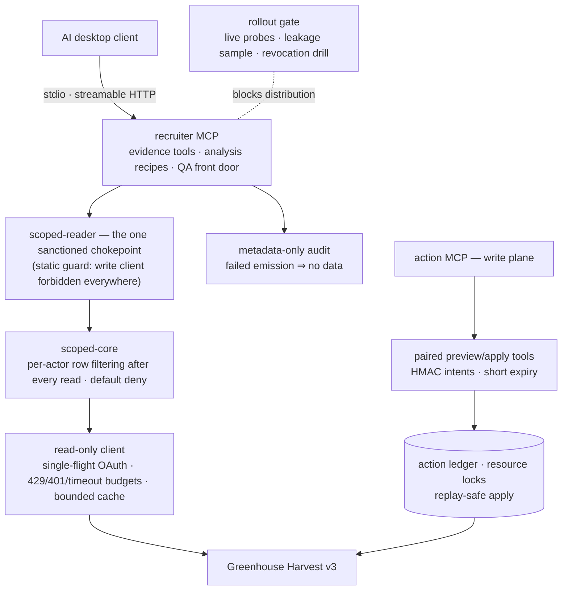
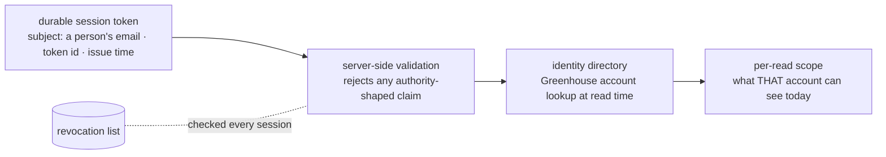

# Greenhouse MCP

**Built by Sam Vangelos.** Permission-scoped MCP servers over our own Greenhouse tenant: per-user
enforcement on every read, paired preview/apply write intents, metadata-only audit, and an
evidence-gated rollout. This is the internal cut — it names the real Supabase projects, the real
Render service, and the real Greenhouse identifiers the system runs against.

Give an AI workspace a Greenhouse API key and you have handed every user the whole tenant: every
candidate, every confidential requisition, every scorecard, regardless of what their own Greenhouse
account is allowed to see. These servers take the opposite position — Greenhouse's own permission
model is the boundary, and the server re-derives and enforces it on every single read, after every
fetch, before anything reaches the model.



---

## How the read-only guarantee is enforced

The claim that a server is read-only is usually a code-review promise. Here it is a static proof
that runs in CI: `packages/recruiter-mcp/scripts/verify-guards.mjs` walks every runtime file and
enforces two rules with no exemptions. The write-bearing Greenhouse client module may not be
imported by any runtime file — the chokepoint included, at any relative path — and the raw read
primitives may be named in exactly one place, `src/scoped-reader.ts`. Every other file gets its data
through the chokepoint, which applies the actor's scope before returning anything.

That design earned its shape adversarially: an earlier version exempted the chokepoint file from the
module rule, so reverting one import would have reloaded the full write surface with the guard still
green. The guard's own test suite proves each rule fires, including that exact regression.

The scoping core underneath (`packages/scoped-core`) filters rows per actor after every fetch and
denies by default: a user Greenhouse lists on nothing sees nothing, and an unrecognized permission
shape fails closed instead of widening.

## Sessions, identity, and per-read scope



Session tokens carry identity, never authority. Issuance refuses to embed roles or scopes; validation
rejects any token that claims them anyway. What a recruiter can see is decided per read, from what
Greenhouse says about their account at that moment — so a permission change in the ATS takes effect
immediately, and a revoked token dies at the next session check. Identity and revocation both live in
the `Greenhouse MCP` Supabase project, `ibxvxmfhovmththllwoi`, whose ref the runtime asserts on every
identity, revocation, bootstrap, and readiness path so a misconfigured deploy fails loudly instead of
quietly reading the separate `recruiting-ops-analytics` project (`ilkbfyubwvbpsevybsfe`).

## The write plane: paired preview and apply

The write plane (`packages/action-mcp`) exposes no direct mutation. Every action is a pair: a preview
tool that computes and signs an intent — an HMAC over the exact change, expiring in minutes — and an
apply tool that will execute only that signed intent, once, under a resource lock, with the outcome
recorded in a ledger before Greenhouse is touched. A replayed apply is a no-op; an expired intent is
a refusal; a drifted target voids the signature. Since `f11a509` the write plane has no separate
service: it mounts inside the recruiter server, so both planes share one URL, one session, and one
audit sink.

## Audit, and the gate that blocks distribution

Every tool call emits metadata-only audit events — who, what tool, which scope, never candidate
content. Emission failure means the data does not flow: the audit sink refusing is treated exactly
like the permission check refusing. Two retained backends exist because Cloud Run cannot append to a
GCS FUSE mount, so `GREENHOUSE_RECRUITER_AUDIT_BACKEND=gcs_object` writes one create-only object per
event instead; an unrecognized backend value fails closed everywhere instead of silently downgrading
audit. The rollout gate extends the same posture to distribution — a build cannot go to recruiters
until live probes, a leakage sample over real responses, and a revocation drill have all passed and
their evidence is on file.

## What the servers connect to

Every read and write in this repository goes to Greenhouse's public Harvest v3 API at
`https://harvest.greenhouse.io`, authenticated as a Harvest OAuth app whose credentials the operator
supplies through `GREENHOUSE_CLIENT_ID` and `GREENHOUSE_CLIENT_SECRET`. The origin is a constant in
`packages/control-plane/src/client-readonly.ts`; there is no configurable base URL and no
private-API adapter mode anywhere in this tree. An earlier operator-facing admin plane that did carry
one was removed in `e2203b9` when the action package replaced it, and `client.ts` is now a three-line
re-export of the read-only client — the write transport it used to expose no longer exists.

## Packages

| Package | What it is |
|---|---|
| `packages/control-plane` | The unscoped operator MCP (~65 read tools) for whoever runs the ATS — see its `start-here.md` |
| `packages/scoped-core` | The security core: actor resolution and per-row permission filtering, dependency-free |
| `packages/recruiter-mcp` | The per-user server: scoped reads, evidence tools, analysis recipes, sessions, audit, OAuth sign-in, rollout gate |
| `packages/action-mcp` | The write plane: paired preview/apply tools over signed intents and a ledger |
| `packages/slack-mcp` | The TA Ops Slack notifier: validated DM delivery with a resolver cache and a user allowlist |

## Running it

```bash
npm ci
npm run verify   # builds the control plane, then typechecks, tests, and guards every package
```

That is 1,896 tests across the five packages and it needs no credentials. One suite skips by design:
the Harvest contract-conformance tests read a vendored mirror of Greenhouse's own API documentation,
which is not redistributed here, so they announce the reason and skip unless you supply a local
mirror under `docs/harvest-v3-api`. Live probes, the Docker smoke harness, and the rollout gate are
separate documented commands that refuse or skip without their credentials.

Each package's README covers its own deployment. The recruiter server ships a production image built
from the workspace root:

```bash
docker build -f packages/recruiter-mcp/deploy/Dockerfile .
```

Configuration is documented in each package's `production.env.example`, and both files carry the real
project refs, not placeholders.

## Where it runs today

The scoped recruiter server runs on Render as service `srv-d92vprtaeets73aqcj50`, with the
`GREENHOUSE_ACTION_*` switches on that service and the shared `Greenhouse MCP` environment group;
both were `true` in production as of `392a69c`. It went out behind the rollout gate with real probes,
a leakage sample over live responses, and a revocation drill. The gate's evidence format is preserved
here as the sanitized `packages/recruiter-mcp/examples/rollout-evidence/` set; the pilot's actual
issued-token evidence is deliberately not in this repository, since those files name real sessions.
The action MCP's release runbook (`packages/action-mcp/deploy/runbook.md`) is partially archived and
says so in its first paragraph — sections 4 and 5 describe the standalone service that no longer
exists, and there is no scheduled reconciler, so an interrupted apply holds its resource lock until
someone runs the manual sweep.
