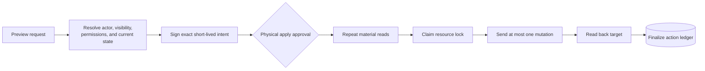

# Greenhouse Action Package

This package implements Greenhouse write capabilities for the recruiter MCP. The
current runtime mounts it inside `packages/recruiter-mcp`; it does not run as a
second MCP service.

The package owns action definitions, signed preview intents, apply validation,
resource locking, durable action state, readback verification, reconciliation, and
operator access commands. The recruiter runtime supplies the authenticated session
and the target-visibility check.

## Capabilities

Each capability has one preview tool and one apply tool:

| Capability | Preview | Apply |
|---|---|---|
| Application assignment | `preview_application_assignment_change` | `apply_application_assignment_change` |
| Job owner | `preview_job_owner_change` | `apply_job_owner_change` |
| Application stage | `preview_application_stage_move` | `apply_application_stage_move` |
| Application rejection | `preview_application_rejection` | `apply_application_rejection` |
| Application unreject | `preview_application_unreject` | `apply_application_unreject` |
| Candidate note | `preview_candidate_note_create` | `apply_candidate_note_create` |
| Job note | `preview_job_note_change` | `apply_job_note_change` |
| Application attribution | `preview_application_attribution_change` | `apply_application_attribution_change` |
| Candidate record | `preview_candidate_record_update` | `apply_candidate_record_update` |
| Offer create | `preview_offer_create` | `apply_offer_create` |
| Offer update | `preview_offer_update` | `apply_offer_update` |

The catalog contains no bulk action and no model-selected method, path, or mutation
body.

## Preview and apply



Preview performs no mutation. It returns the target, before-state, proposed
after-state, effects, and a signed intent bound to the actor, session, action,
parameters, fingerprints, resource lock, and expiry.

Apply accepts the signed intent and approval echo. It rechecks identity,
entitlement, revocation, target visibility, current state, and the enabled
capability before it crosses the mutation fence. A conversational confirmation is
not the approval boundary; the client must stop on the physical apply tool call.

## Runtime controls

- `GREENHOUSE_ACTION_SERVICE_ENABLED` controls whether eligible sessions can
  receive action tools and defaults to `false`.
- `GREENHOUSE_ACTION_WRITES_ENABLED` controls whether apply can send a mutation
  and defaults to `false`.
- `GREENHOUSE_ACTION_CAPABILITIES` narrows the preview/apply catalog by action
  kind.
- `GREENHOUSE_ACTION_WRITE_CAPABILITIES` narrows the kinds whose apply path can
  execute.
- Per-user, per-client entitlements independently grant preview, apply, and
  high-impact apply.

Catalog removal affects new MCP calls. The reconciler retains the action
definitions needed to resolve existing ledger rows.

## Durable state and recovery

The shared `greenhouse_action` ledger stores bindings, keyed fingerprints, lock
state, deadlines, and outcomes. It excludes note bodies, candidate contact arrays,
offer compensation values, bearer tokens, prompts, and other sensitive payloads.

Actions serialize on a resource key such as `application:{id}`,
`candidate:{id}`, `job:{id}`, or `offer-chain:{application_id}`. Replaying an
action id returns the recorded state and cannot send another mutation.

A timeout, network failure, HTTP 408 or 5xx, asynchronous acknowledgement, or
inconclusive readback becomes `unknown`. Apply does not retry the business
mutation. `greenhouse-action-reconcile` performs read-only observations and
updates the ledger when desired state, original state, or a conflict can be
established.

## Session integration

`packages/recruiter-mcp/src/action-session.ts` derives a short-lived action
session from the signed recruiter session. The derived id is stable for the parent
token, bound to the physical client, and checked against both parent and action
revocation.

`packages/recruiter-mcp/src/action-plane.ts` mounts the package only after the
service switch, configuration, identity, and entitlement checks pass. It uses the
current session's scoped recruiter reads as the visibility fence. Mount failure
withholds action tools without taking down the read catalog.

## Operator commands

| Command | Purpose |
|---|---|
| `greenhouse-action-access provision` | Resolve a reviewed roster, create entitlements, and issue per-client sessions |
| `greenhouse-action-access disable` | Disable one identity/client entitlement |
| `greenhouse-action-access revoke` | Revoke one issued token id |
| `greenhouse-action-access check-db-url` | Validate the action-state install credential without printing it |
| `greenhouse-action-reconcile` | Resolve pending or unknown actions through readback |

Generated session files contain bearer tokens. Store them outside source paths,
deliver them only to the intended user and client, and retain token-free manifests
after delivery.

## Configuration

The integrated server's active action variables are documented in
[`../recruiter-mcp/deploy/production.env.example`](../recruiter-mcp/deploy/production.env.example).
Install-time and reconciler-only variables are documented in
[`deploy/production.env.example`](deploy/production.env.example).

The action runtime uses a write-scoped Harvest credential. Reconciliation uses a
different OAuth client id so one process's token lifecycle cannot invalidate the
other. Neither credential is shared with the recruiter read client.

Required Harvest scopes:

- Applications: `harvest:applications:list`, `harvest:applications:update`,
  `harvest:applications:move`, `harvest:applications:reject`, and
  `harvest:applications:unreject`
- Access and job context: `harvest:users:list`, `harvest:jobs:list`,
  `harvest:user_job_permissions:list`, `harvest:job_owners:list`,
  `harvest:job_owners:create`, and `harvest:job_owners:destroy`
- Stages and rejections: `harvest:application_stages:list`,
  `harvest:job_interview_stages:list`, `harvest:rejection_reasons:list`, and
  `harvest:rejection_details:list`
- Candidates and notes: `harvest:candidates:list`, `harvest:candidates:update`,
  `harvest:notes:list`, and `harvest:notes:create`
- Job notes: `harvest:job_notes:list`, `harvest:job_notes:create`,
  `harvest:job_notes:update`, and `harvest:job_notes:destroy`
- Attribution and offers: `harvest:sources:list`, `harvest:referrers:list`,
  `harvest:offers:list`, `harvest:offers:create`, and `harvest:offers:update`
- Custom fields: `harvest:custom_fields:list` and
  `harvest:custom_field_options:list`

The SQL contract is [`supabase/action-state.sql`](supabase/action-state.sql).
Apply it explicitly with a reviewed database credential; the package does not own
the scoped reader's other migrations.

## Verification

From the workspace root:

```bash
npm ci
npm --workspace @greenhouse-mcp/action-mcp run verify
```

The package gate covers the fixed capability catalog, intent domains, preview
sanitization, target visibility, exactly-once mutation fencing, ambiguous outcome
handling, reconciliation, durable-state hygiene, and operator access commands.

The SQL smoke test requires a disposable Postgres:

```bash
npm --workspace @greenhouse-mcp/action-mcp run smoke:sql
```

The combined production image and deployment entrypoint belong to the recruiter
package:

```bash
docker build -f packages/recruiter-mcp/deploy/Dockerfile .
```
