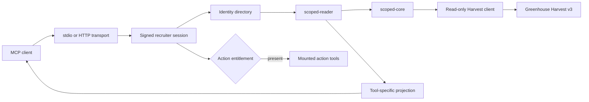

# Scoped Recruiter Greenhouse MCP

This package is the current recruiter-facing runtime. It serves a curated MCP
catalog over stdio or Streamable HTTP, resolves each session to a Greenhouse user,
and permission-filters every read before data reaches the client model.

For sessions with an active write entitlement, the runtime also mounts the action
package's preview/apply tools. Unentitled sessions receive the same read-only
catalog they would receive in a deployment without the action plane.

## Request path



Session tokens carry identity, protocol surface, physical client, token id, and
issue time. They do not carry Greenhouse roles, job ids, or permission claims.
The runtime resolves current ATS access for each scoped read and denies unknown
permission shapes.

## Model-facing catalog

The canonical catalog is defined and ordered in
[`src/tools/register.ts`](src/tools/register.ts). Package guards and the container
self-check reject missing, duplicate, reordered, or unexpected tools.

| Tool family | Purpose |
|---|---|
| Job scope | Resolve, confirm, and inspect the requisitions available to the session |
| Deterministic analysis | Feedback accountability, interview drag, stage latency, pipeline state, source outcomes, and rejection-reason drift |
| Evidence reads | Scoped jobs, applications, interviews, offers, candidates, scorecards, notes, attachments, stages, owners, and reference dictionaries |
| Resume read | Explicit attachment-id lookup and bounded text extraction |

Analysis tools calculate their metrics in code and return structured evidence
references. The model can explain the result, but it does not calculate the
underlying counts, rates, rankings, or risk scores.

The tool surface exposes only supported parameters. Actor identity and raw
operator-only controls are removed before the scoped reader runs.

## Read boundaries

`src/scoped-reader.ts` is the sole sanctioned caller of raw Greenhouse read
primitives. `scripts/verify-package.mjs` statically enforces that chokepoint and
forbids recruiter runtime imports of the write-bearing Greenhouse client.

Returned records pass through two filters:

1. `scoped-core` removes rows the current Greenhouse user cannot access.
2. The individual tool projection removes fields outside that tool's contract.

Candidate tools return the candidate's name, email addresses and phone numbers
(what a Job Admin sees in Greenhouse); no tool returns home addresses, raw
profiles, resume contents, signed attachment URLs, or raw rows. Audit events contain bounded operational
metadata rather than candidate content.

Audit is fail-closed when required. If the configured sink cannot accept the
event, the protected result is not returned.

## Resume reads

`read_my_resume` accepts one positive attachment id. Before fetching the file,
the runtime performs a fresh scoped attachment lookup and requires exactly one
visible attachment classified as a resume.

The server downloads and extracts PDF, DOCX, or UTF-8 text internally. The
download and extracted output are size-capped, the operation has a bounded
deadline, and the result contains extracted text rather than file bytes or a
signed URL. Resume text is marked as untrusted candidate-authored content.

## Mounted action tools

The action plane is loaded from `../action-mcp` into the recruiter runtime. It is
withheld when its service flag is off, configuration is incomplete, session
derivation fails, the entitlement store is unavailable, or the current identity
has no preview entitlement. A write-plane failure does not remove recruiter read
access.

An entitled session receives the action package's fixed preview/apply pairs after
the read catalog. The session's own scoped read path supplies the visibility fence
for each target. Apply remains separately gated by write flags, capability
allowlists, approval binding, current-state checks, and the action ledger.

See [`../action-mcp/README.md`](../action-mcp/README.md) for the action contract.

## Transports and image

| Surface | Entrypoint |
|---|---|
| Streamable HTTP | `bin/greenhouse-recruiter-mcp-http.mjs` |
| stdio | `bin/greenhouse-recruiter-mcp.mjs` |
| Container self-check | `bin/greenhouse-recruiter-container-self-check.mjs` |

Build the combined recruiter/action image from the workspace root:

```bash
docker build -f packages/recruiter-mcp/deploy/Dockerfile .
```

The image runs the HTTP entrypoint as a non-root user and exposes public liveness
plus protected readiness checks. The environment contract is
[`deploy/production.env.example`](deploy/production.env.example).

## Session and rollout operations

The package includes commands for identity bootstrap, roster preflight, session
issuance and revocation, client configuration, live probing, leakage sampling,
audit review, distribution validation, and rollout-gate evaluation. Their
entrypoints are listed under `bin/`; sanitized evidence shapes live under
`examples/rollout-evidence/`.

Issued session files contain bearer credentials. Generate them only in an ignored
or external secure directory, deliver each file to its intended user and client,
then retain token-free manifests rather than token-bearing artifacts.

The rollout gate evaluates current environment checks, catalog and transport
validation, scoped live probes, leakage samples, audit review, session revocation,
and real-client tests. The default unit suite validates the gate logic but does
not create live rollout evidence.

## Verification

From the workspace root:

```bash
npm ci
npm run verify
node packages/recruiter-mcp/scripts/verify-package.mjs
```

The package-level gate is also available directly:

```bash
npm --workspace @greenhouse-mcp/recruiter-mcp run verify
```

The credential-free suite covers scoping, projections, identity, sessions,
transports, audit behavior, action mounting, catalog integrity, and rollout
evidence validation. Live probes and distribution checks require their own
credentials and evidence directories.
